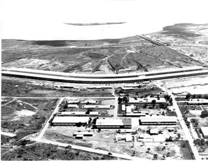

**ATENÇÃO** Página em Construção.

Neste espaço irei postar informações relevantes sobre as disciplinas que ministro na UnB. Aos poucos espero disponibilizar
todo o material produzido neste espaço.

## **Disciplinas** 

### Semestres Atual (2020/2)
- Fundamentos de Ciências da Natureza
- Luz e Som

### Semestres Anteriores
- Natureza e Energia
- Física 1    
- Química e Tecnologia
- Física 2
- Simulação Computacional em Ciência de Materiais (linguagem Python)
- Simulação Computacional em Ciência de Materiais (linguagem C)
- Física Estatística

### MiniCursos (Grupos de Estudo)

- Introdução à Programação em linguagem C
- Introdução às Simulações de Monte Carlo
- Introdução ao Sistema Operacional Linux (Ubuntu)

### *Créditos das fotografias*

- Foto de capa por <a href="https://unsplash.com/@joaopedrovergara?utm_source=unsplash&amp;utm_medium=referral&amp;utm_content=creditCopyText">João Pedro Vergara</a> via <a href="https://unsplash.com/s/photos/unb?utm_source=unsplash&amp;utm_medium=referral&amp;utm_content=creditCopyText">Unsplash.</a>.
- Foto [Minhocão/UnB em Construção](https://atom.unb.br/index.php/00110).